# EUReCA 2021 - Effects of Degradation on Face Detectors

## Table of Contents
- [Description](#Description)
- [Abstract](#Abstract)
- [Face Detectors](#face-detectors)
- [Degradation](#Degradation)
- [Recovery](#Recovery)
- [Results](#Results)
- [Running Code](#running-code)


## Description:
This project was done to complete one of my breadth requirements for the Tickle Engineering Honors program. The contents of the project were presented at the 2021 EUReCA Symposium as a [poster](poster.pdf). To keep proper context, the project was completed within **less than a month** and is a continuation of adjacent, prior works regarding image degradation and Convolutional Neural Networks.

## Abstract

With the popularization of object detection via convolutional neural networks (CNN), major work has been done with specialized detection tasks, such as using CNNs for facial recognition and detection. Additionally, CNNs have now been deployed in practical settings, where the networks must work with sub-par equipment and operate in non-ideal environments.

In this research project, we look into some of the standard image-based obstacles faced by state-of-the-art face detectors in the real world, such as degraded camera quality and transmission interruptions. With these obstacles, we experiment and quantitatively describe how the CNNs react in these scenarios.

Additionally, we reconstruct the “degraded” image with various image processing methods in order to recover detection accuracy. Furthermore, we quantitatively establish connections between certain recovery methods, their intensity, as well as the intensity of the degradation with the ability to recover the detection accuracy.


## Face Detectors:

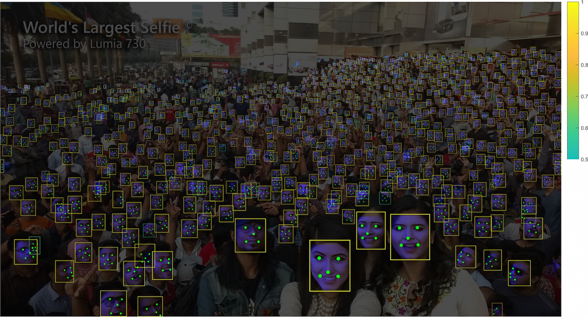


- TinaFace (part of VedaDetector)
	
	- **Description:** TinaFace is the SoTA (as of this writing) in terms of realtime face detection on the WIDERFACE testset. The model utilizes recent advancements in general object detection and frames the face detection task as a "small-object" detection task.  

- RetinaFace
	
	- **Description:** RetinaFace is a realtime face detector that was released in late-2019. It utilizes information summarized from a **multi-task objective loss function** in order to improve "small-face" detection. This object detector also was able to produce facial landmarks, and the authors themselves labeled the landmarks within the `train` and `validation` sets of WIDERFACE. The landmarks were also used in the multi-task objective loss function.

- DSFD (Dual-Shot Face Detector)
	
	- **Description:** DSFD was a model created by 
	- **Note:** The DSFD used in this project was a optimized version, which was ~9% off the original DSFD WIDERFACE validation score (81% vs 89% on the hard-set). The DSFD network utilizes "better feature learning, progressive loss design, and anchor assign based data augmentation."

### Degradation

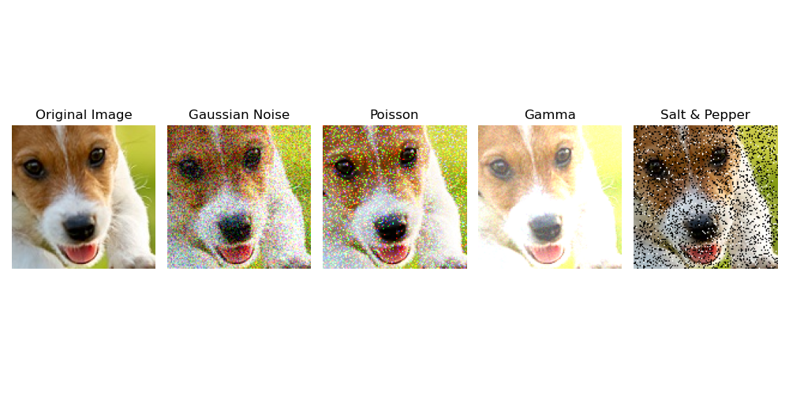

- **Gaussian Noise**

	- **Description:** Commonly occurs in digital photography. For this project, the Gaussian Distribution was varied by adjusting the standard deviation. By adjusting standard deviation, the noise matrix values become higher in the [0-255] color scale. This in turn increases the visibility of noise on the image.

- **Salt & Pepper**

	- **Description:** This type of noise occurs in sharp pulses during image transmission. The variable for this noise is the percentage of the image "covered" with a white or black pixel. The ratio of white to black pixels within the noise distribution is fixed.

- **Poisson**

	- **Description:** This noise occurs within CT & X-Ray scans as a result of stray radiation bombardment. The noise distribution is controlled by the lambda parameter.

- **Gamma**

	- **Description:** This noise is similar to Poisson, but the noise distribution is varied by "gamma shape", and as the gamma shape increases, the image becomes more "white-washed". This is similar to increasing uniform gamma factor, where a higher gamma factor increases the brightness.

### Recovery

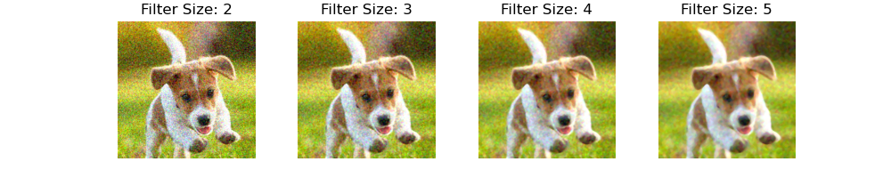

- **Median Filter:**

	- **Description:** Use a `nxn` kernel (where `n` is a non-zero integer) and slides through image. While sliding, it takes the median value of the pixel values within the kernel and assigns that value to those pixels. This method "smoothens" the image out, and the larger the kernel size, the smoother the image.

- **Histogram Equalization:**

	- **Description:** Plot the frequency of each pixel value (with a histogram) and equalizes those frequencies. This histogram plotting and equalization occurs channel-by-channel basis. In terms of channels, the histogram equalization is applied in the YCbCR color space(Luminance, Chroma Blue, Chroma Red).

**Note:** Both correction methods can have an optimized runtime of <10-20ms, which makes them suitable for real-time corrections.

## Results

The following are graphs showing the decreasing shape of mAP as a given noise's intensity rises.

### Gaussian Blur

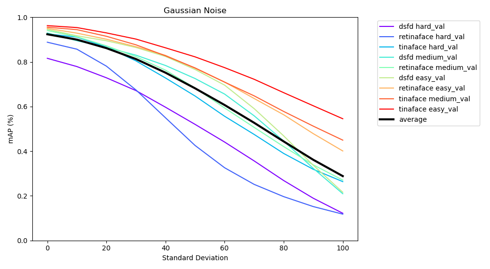

### Salt & Pepper

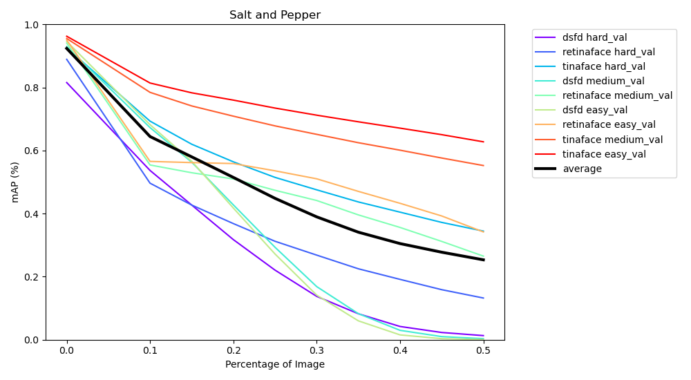

### Poisson

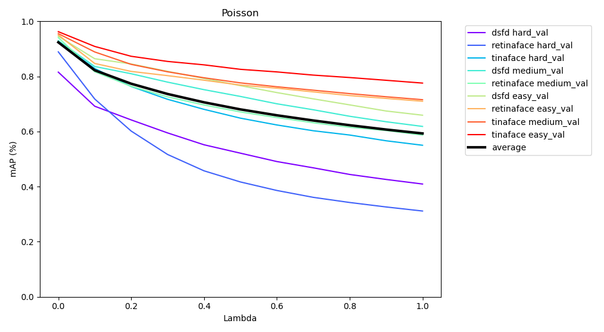

### Gamma

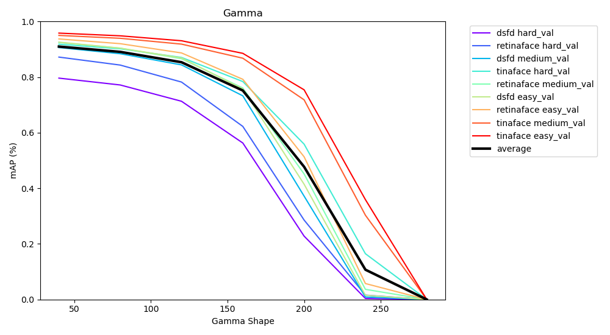

The following are graphs representing the trend of recovery for each noise intensity of a given noise at a certain level of a correction. Median filter was applied to Salt & Pepper, Gaussian Blur, and Poisson while Histogram Equalization was applied to Gamma alone.

### Retinaface

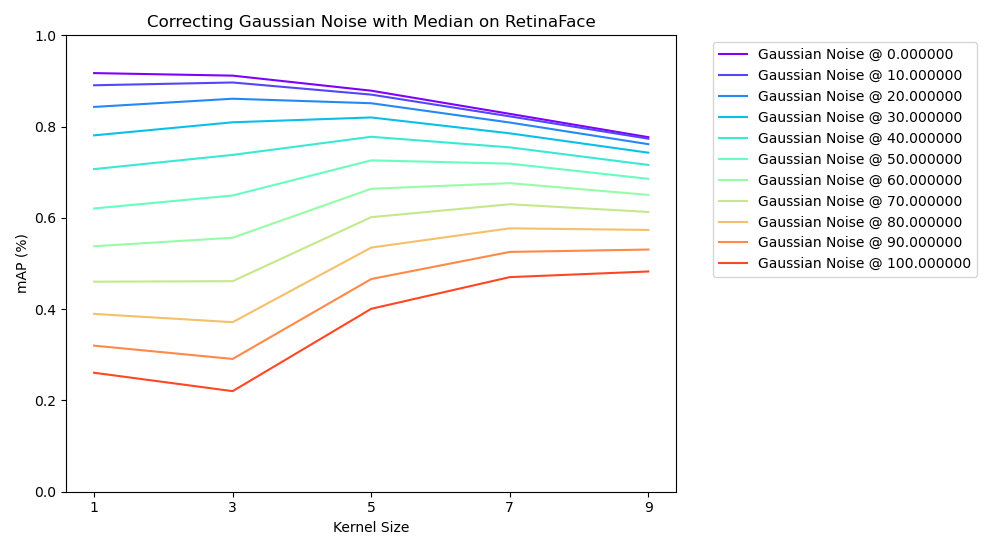

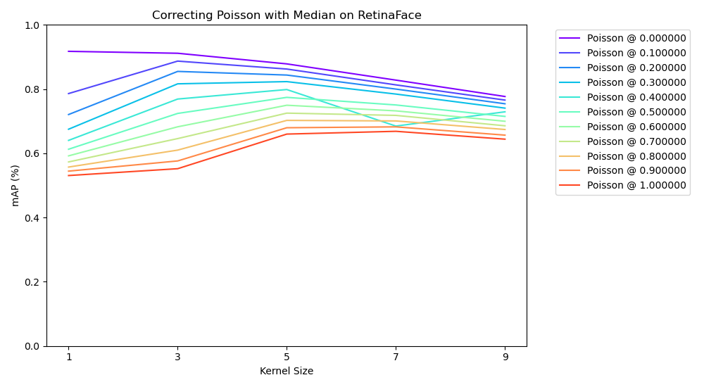

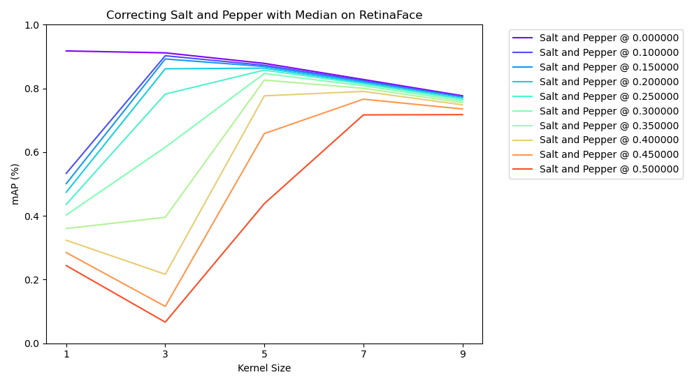

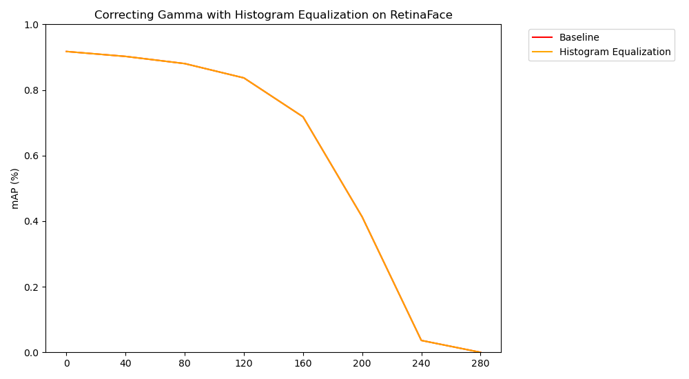

### DSFD

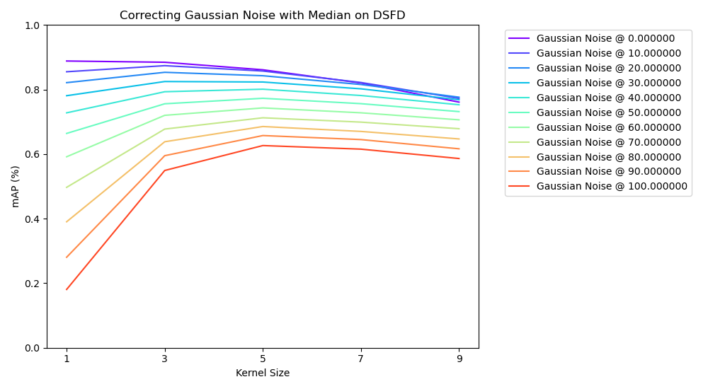

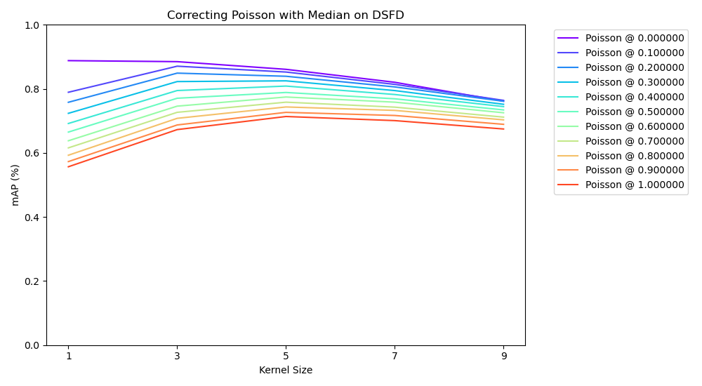

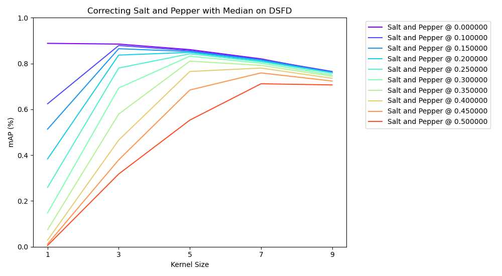

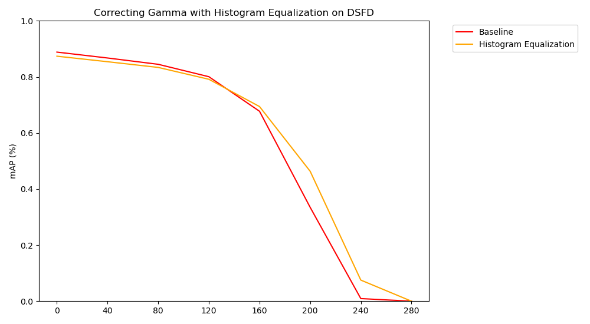

### Tinaface
``Uncompleted``


## Conclusions

This project shows the degradation behavior that noises such as Gaussian Blur and Salt & Pepper have on highly-accurate face detectors. Salt & Pepper had an accuracy decrease "shape" resembling an inverted S-curve. I believe this is mainly due to the fact that sharp pixel-wise color changes, such as completely black or white, can have drastic effects on the feature extraction from the first set of convolution layers, which can have a cascading effect later on in the network.

For a similar reason, this is why you see tamer accuracy decrease "shapes" for Poisson and Gamma (although the later half of Gamma had a drastic decrease -- this is because at a certain point the white-washing had removed enough features to the point where the image is basically white to us).

Gaussian noise had a neutral accuracy decrease "shape". I believe the reason for this is because the noise is colored and the distribution of colors at most noise levels are not large enough to drastically affect the original pixel color. Only at higher noise intensities do the values become significant enough for the original color values to significantly shift from their original "domain" of color. With this significant shift, an object's features will be unrecognizable. 

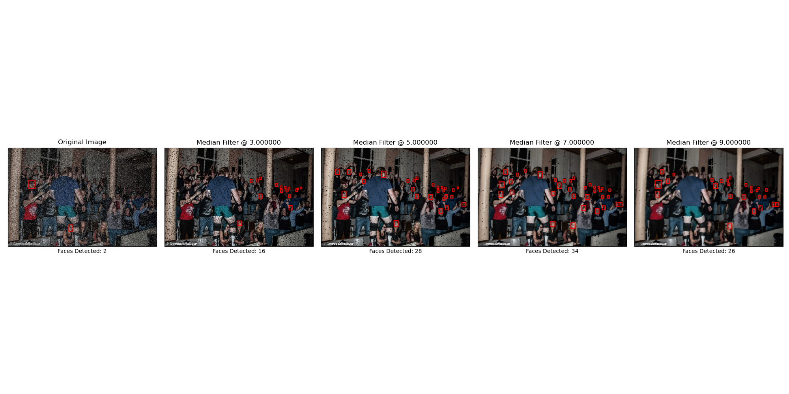

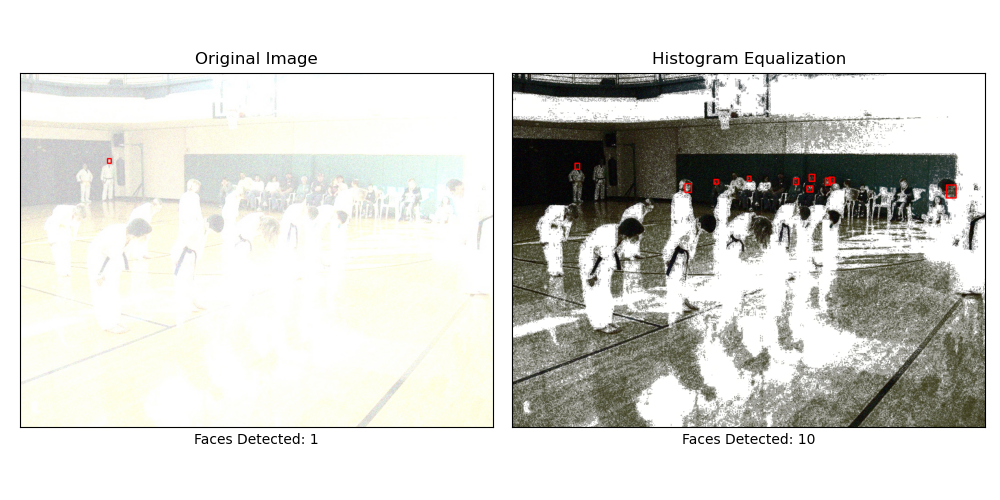

---

# Running Code

## Environment Setup

You will need to setup a standard Anaconda environment and run the following command to create the same environment that was used to run this code: ``conda env create -f requirements.yaml``

You will also need an installation of Matlab (the version used in this project was 2020b but older versions might work). If Matlab is not available, try using **Octane** as an alternative. 

## Dataset Setup

After the conda environment is created, download the [WIDERFACE dataset](http://shuoyang1213.me/WIDERFACE/). 

The only portions you will need are the [WIDERFACE validation dataset](https://drive.google.com/file/d/0B6eKvaijfFUDd3dIRmpvSk8tLUk/view) as well as the [evaluation tools](http://shuoyang1213.me/WIDERFACE/support/eval_script/eval_tools.zip). Keep the original class-based folder structure and place both evaluation tool folders and the validation set ("WIDER_val") in a folder called "WIDERFACE". Copy contents from the `WF_eval_files` into the `eval_tools` folder in WIDERFACE. You should copy the original evaluation files that these files are replacing These modified Matlab files are edited to output the mAP results from the evaluation as a text file rather than plotting the PR curve.


## Folder Structure

- `WIDERFACE` folder will hold the original images and the evaluation tools
- `NOISES` folder will hold all noises. Each noise folder will hold an intensity, and each intensity folder will contain "images" (the altered images) and "detections" folder with text files in the WIDERFACE format.
- `CORRECTIONS` folder will hold all possible correction and noise combinations. Each combination holds the correction and noise level folders. Each folder contains the WIDERFACE folder structure with detection files.

## Setting up CNNs

### TinaFace

Clone this network's [repository](https://github.com/Media-Smart/vedadet), download the [pretrained weights](https://drive.google.com/file/d/1zU738coEVDBkLBUa4hvJUucL7dcSBT7v/view?usp=sharing) for TinaFace, and place those weights in a newly-created folder called "weights".

`git clone https://github.com/Media-Smart/vedadet`

Merge this repo with the `vedadet` folder in this repo. This repo contains a custom file and configuration file that is constructed 

### RetinaFace

Clone this network's [repository](https://github.com/deepinsight/insightface), take only the "RetinaFace" folder, rename it to "retinaface", and merge its contents with this project's "retinaface" folder. This project's "retinaface" folder contains a python file that evaluates WIDERFACE  with the original directory structure. Also, download the pretrained weights located in the [RetinaFace README](https://github.com/deepinsight/insightface/tree/master/detection/RetinaFace#retinaface-pretrained-models).

`git clone https://github.com/deepinsight/insightface.git`

### DSFD

Clone this network's [repository](https://github.com/hukkelas/DSFD-Pytorch-Inference), rename the folder to "dsfd", and merge this folder with this project's "dsfd" folder.

## Running Evaluations

Create the degraded images that we will be using (saves time during inferencing):

``` bash
bash setup_dataset.sh
```


Run the following bash scripts in order:
``` bash
# Run detection on the noises only:
bash run_retinaface.sh; bash run_tina.sh; bash run_dsfd.sh

# Run detection on corrections as well:
bash run_corrections.sh

# Evaluate the mAPs of all of the things we just detected over:
bash run_wider_eval.sh
```