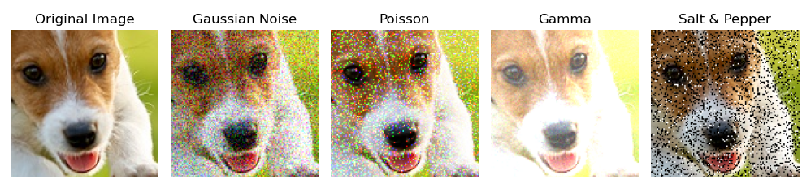
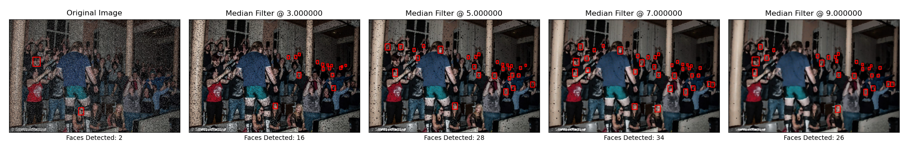

# EUReCA 2021 - Effects of Degradation on Face Detectors

## Table of Contents
---
- Description
- Abstract
- Face Detectors
- Degradation
- Recovery
- Results
- Running Code


## Description:
This project was done to complete one of my breadth requirements for the Tickle Engineering Honors program. The contents of the project were presented at the 2021 EUReCA Syposmium as a [poster](poster.pdf). To keep proper context, the project was completed within **less than a month** and is a continuation of adjacent, prior works regarding image degradation and Convolutional Neural Networks.

## Abstract

With the popularization of object detection via convolutional neural networks (CNN), major work has been done with specialized detection tasks, such as using CNNs for facial recognition and detection. Additionally, CNNs have now been deployed in practical settings, where the networks must work with sub-par equipment and operate in non-ideal environments.

In this research project, we look into some of the standard image-based obstacles faced by state-of-the-art face detectors in the real world, such as degraded camera quality and transmission interruptions. With these obstacles, we experiment and quantitatively describe how the CNNs react in these scenarios.

Additionally, we reconstruct the “degraded” image with various image processing methods in order to recover detection accuracy. Furthermore, we quantitatively establish connections between certain recovery methods, their intensity, as well as the intensity of the degradation with the ability to recover the detection accuracy.


## Face Detectors In Use:
- TinaFace (part of VedaDetector)
	
	- **Description:** TinaFace is the SoTA (as of this writing) in terms of realtime face detection on the WIDERFACE testset. The model utilizes recent advancements in general object detection and frames the face detection task as a "small-object" detection task.  

- RetinaFace
	
	- **Description:** RetinaFace is a realtime face detector that was released in late-2019. It utilizes information summarized from a **multi-task objective loss function** in order to improve "small-face" detection. This object detector also was able to produce facial landmarks, and the authors themselves labeled the landmarks within the `train` and `validation` sets of WIDERFACE. The landmarks were also used in the multi-task objective loss function.

- DSFD (Dual-Shot Face Detector)
	
	- **Description:** DSFD was a model created by 
	- **Note:** The DSFD used in this project was a optimized version, which was ~9% off the original DSFD WIDERFACE validation score (81% vs 89% on the hard-set). The DSFD network utilizes "better feature learning, progressive loss design, and anchor assign based data augmentation."

### Degradation:



- **Gaussian Noise**

	- **Description:** Commonly occurs in digital photography. For this project, the Gaussian Distribution was varied by adjusting the standard deviation. By adjusting standard deviation, the noise matrix values become higher in the [0-255] color scale. This in turn increases the visibility of noise on the image.

- **Salt & Pepper**

	- **Description:** This type of noise occurs in sharp pulses during image transmission. The variable for this noise is the percentage of the image "covered" with a white or black pixel. The ratio of white to black pixels within the noise distribution is fixed.

- **Poisson**

	- **Description:** This noise occurs within CT & X-Ray scans as a result of stray radiation bombardment. The noise distribution is controlled by the lambda parameter.

- **Gamma**

	- **Description:** This noise is similar to Poisson, but the noise distribution is varied by "gamma shape", and as the gamma shape increases, the image becomes more "white-washed". This is similar to increasing uniform gamma factor, where a higher gamma factor increases the brightness.

### Recovery:


- **Median Filter:**

	- **Description:** Use a `nxn` kernel (where `n` is a non-zero integer) and slides through image. While sliding, it takes the median value of the pixel values within the kernel and assigns that value to those pixels. This method "smoothens" the image out, and the larger the kernel size, the smoother the image.

- **Histogram Equalization:**

	- **Description:** Plot the frequency of each pixel value (with a histogram) and equalizes those frequencies. This histogram plotting and equalization occurs channel-by-channel basis. In terms of channels, the histogram equalization is applied in the YCbCR color space(Luminance, Chroma Blue, Chroma Red).

**Note:** Both correction methods can have an optimized runtime of <10-20ms, which makes them suitable for real-time corrections.

## Results

The following are graphs showing the decreasing shape of mAP as a given noise's intensity rises.

### Gaussian Blur:


### Salt & Pepper:


### Poisson:


### Gamma:


The following are graphs representing the trend of recovery for each noise intensity of a given noise at a certain level of a correction. Median filter was applied to Salt & Pepper, Gaussian Blur, and Poisson while Histogram Equalization was applied to Gamma alone.

### Retinaface:


### DSFD:


### Tinaface:
``Uncompleted``


## Conclusions:




---

# Running Code

## Environment Setup:

You will need to setup a standard Anaconda environment and run the following command to create the same environment that was used to run this code: ``conda env create -f requirements.yaml``

After the conda environment is created, download the WIDERFACE dataset. The only portions you will need are the WIDERFACE validation dataset as well as the evaluation tools. Keep the original class-based folder structure and place both evaluation tool folders and the validation set ("WIDER_val") in a folder called "WIDERFACE".

## Folder Structure:
- The direct children folders represent just the raw source codes from the detectors. I will have to take them apart and run them seperately inside the folder `eureca_face`.
- `eureca_face` will contain all the major code that can/will be runnable from a fresh installation. It will hold the evaluation results and processed information.
- `WIDERFACE` folder will hold ALL of the preprocessed images

## Setting up CNNs:

### TinaFace:

### RetinaFace:

### DSFD:

## Running Evaluations:

Create the degraded images that we will be using (saves time during inferencing):

``` bash
bash setup_dataset.sh
```


Run the following bash scripts in order:
``` bash
# Run detection on the noises only:
bash run_retinaface.sh; bash run_tina.sh; bash run_dsfd.sh

# Run detection on corrections as well:
bash run_corrections.sh

# Evaluate the mAPs of all of the things we just detected over:
bash run_wider_eval.sh
```